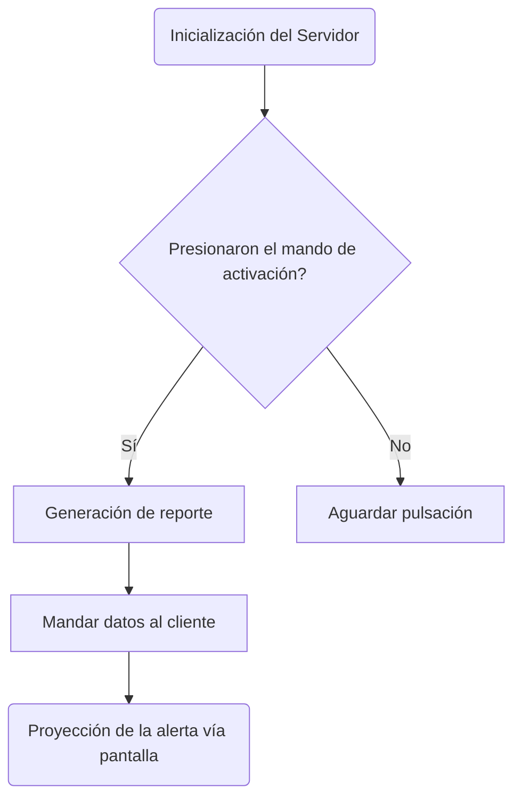

# ALARMA CÓDIGO AZUL - SP #

## EJECUCIÓN

 <strong>CLONAR REPOSITORIO</strong>

```git clone https://github.com/Zagon22/ALARMA-COD-AZUL-INET```

 <strong>ABRIR REPOSITORIO</strong>

```cd 'ALARMA-COD-AZUL-INET' && code .```

 <strong>INSTALAR DEPENDENCIAS</strong>

```npm i -y```

 <strong>EJECUTAR</strong>

```npm run dev```

## FUNCIONAMIENTO



## HERRAMIENTAS

1. DBeaver.
2. Visual Studio Code.
3. Arduino IDE.

## TECNOLOGÍAS

1. HTML.
2. CSS.
3. JavaScript.
4. Node.js.
5. Express.
6. SerialPort.
7. Socket.io.
8. MySQL.

## HARDWARE

1. Arduino UNO.
2. Cable serial.
3. Protoboard.
4. Pulsador x2.
5. Cables dupont x6.
6. Resistencia de 220 Ohm x2.
